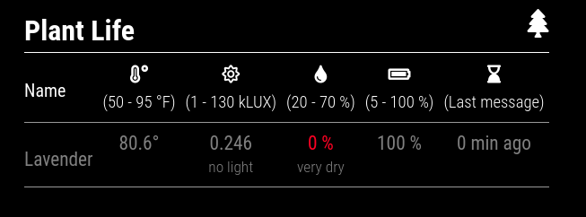
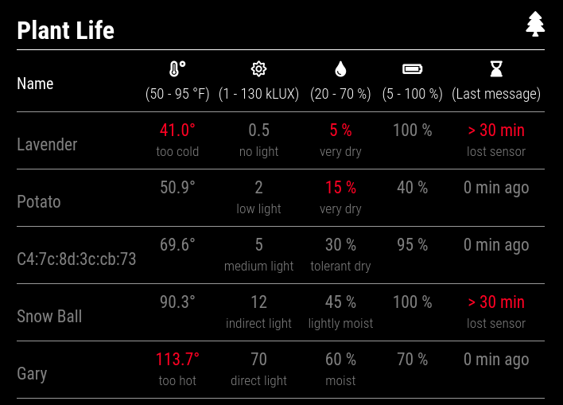
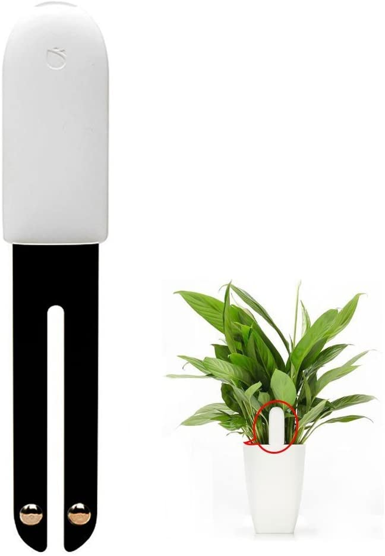

# MMM-miflora

This is an extension for the [MagicMirror²](https://github.com/MichMich/MagicMirror).

This extension monitors temperature, light, moisture and battery level from the [Xiaomi MiFlora Monitor](https://us.amazon.com/Xiaomi-Moisture-Testing-Gardens-International/dp/B074TY93JM).
The MiFlora monitor helps convey the status of potted plant to make sure they are receiving
sufficient moisture and light.






## Installation

- (1) Install the following bluetooth packages and allow non-root access.
```bash
sudo apt-get install bluetooth bluez libbluetooth-dev libudev-dev
sudo setcap cap_net_raw+eip $(eval readlink -f `which node`)
```

Please refer to the [Noble instructions for running on Linux](https://github.com/noble/noble#running-on-linux).

- (2) Clone this repository in your `modules` folder, and install dependencies:
```bash
cd ~/MagicMirror/modules # adapt directory if you are using a different one
git clone https://github.com/asuar078/MMM-miflora.git
cd MMM-miflora
npm install
```

- (3) Add the module to your `config/config.js` file.
```javascript
{
    module: 'MMM-miflora',
    position: 'top-right',
    config: {
        updateInterval: 60, //seconds
        units: "imperial", // or metric
    }
},
```

## Configuration Options

| Configuration   | Description |
| ----------- | ----------- |
| updateInterval | In seconds how often to poll monitor |
| titleText | Title at head of table |
| units | Either 'imperial' or 'metric' |
| decimalSymbol | Symbol used for decimal point |

## Sample Output

The following is a sample of the data that is received from the MiFlora Monitor.

```javascript
[ { address: 'c4:7c:8d:6b:ca:9e',
    type: 'MiFloraMonitor',
    firmwareInfo: { battery: 100, firmware: '3.2.4' },
    sensorValues: { temperature: 22.4, lux: 230, moisture: 0, fertility: 0 },
    friendlyName: 'lavender',
    timeStamp: 1614954202204 } ]

```

## Values Explained

The extension pull temperature, lux, moisture and battery level from the MiFlora Monitor. 
On the table each value is shown with a recommend range on top and a basic explanation of what 
it means as a comment on the bottom. For example a light value of 5 kiloLUX would fall into the 
medium light category with is perfect for plants that want medium light. 

From right to left the table shows the name of the sensor, temperature, light or lux, moisture, 
battery level, and lastly the last time a message was received from the sensor. 


## Friendly Name

When a new sensor is found the address is added to a json file named `friendlyNameLookup.json`.
To change from the address name on the table replace the `name` field on the entry with whatever
friendly name you like. There is a 30 character limit.

```json
{
    "lookup":
    [
        {"address":"default","name":"unknown"},
        {"address":"c4:7c:8d:6b:ca:9e","name":"lavender"},
        {"address":"c4:7c:8d:6b:ca:9F","name":"potato"}
    ]
}
```
